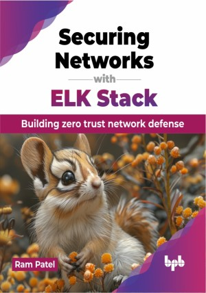

# Securing Networks with ELK Stack

Strengthening networks, redefining security: ELK Stack leading the charge

This is the repository for [Securing Networks with ELK Stack
](https://bpbonline.com/products/securing-networks-with-elk-stack?variant=43831309304008),published by BPB Publications.

## About the Book
Step into the dynamic world of zero trust network architecture with this comprehensive handbook. Starting with an exploration of zero trust principles, each chapter unveils new insights and practical strategies. From crafting strategic blueprints to implementing hands-on deployment tactics, discover the intricacies of building a resilient zero trust network capable of thwarting modern threats.

Journey through the extensive capabilities of ELK Stack, essential for fortifying a zero trust paradigm. Learn the nuances of data acquisition strategies and efficient ingestion methods with ELK, enabling robust data visualization and dashboard creation using Kibana. Explore advanced functionalities like Machine Learning driven anomaly detection to enhance your defenses against emerging threats. Explore Elastic Security's suite, encompassing threat detection, incident response, and compliance reporting, crucial elements in strengthening network defenses. Utilize the transformative potential of Zeek in network security, from foundational principles to advanced integration with Elastic Security. Real-world case studies showcase the synergy between Zeek and Elastic Security, providing insights into future-proof network protection strategies.

Arm yourself with the knowledge and tools necessary to navigate the evolving landscape of network security. Traverse the realms of zero trust architecture, ELK Stack, and Elastic Security, empowered by practical insights and real-world applications.

## What You Will Learn
• Understanding the core principles and intricacies of zero trust network architecture.

• Designing and deploying a robust zero trust network using strategic methodologies.

• Leveraging ELK Stack's capabilities to support and enhance a zero trust approach.

• Implementing effective data gathering and ingestion strategies with ELK.

• Mastering data visualization and dashboard creation using Kibana for actionable insights.
